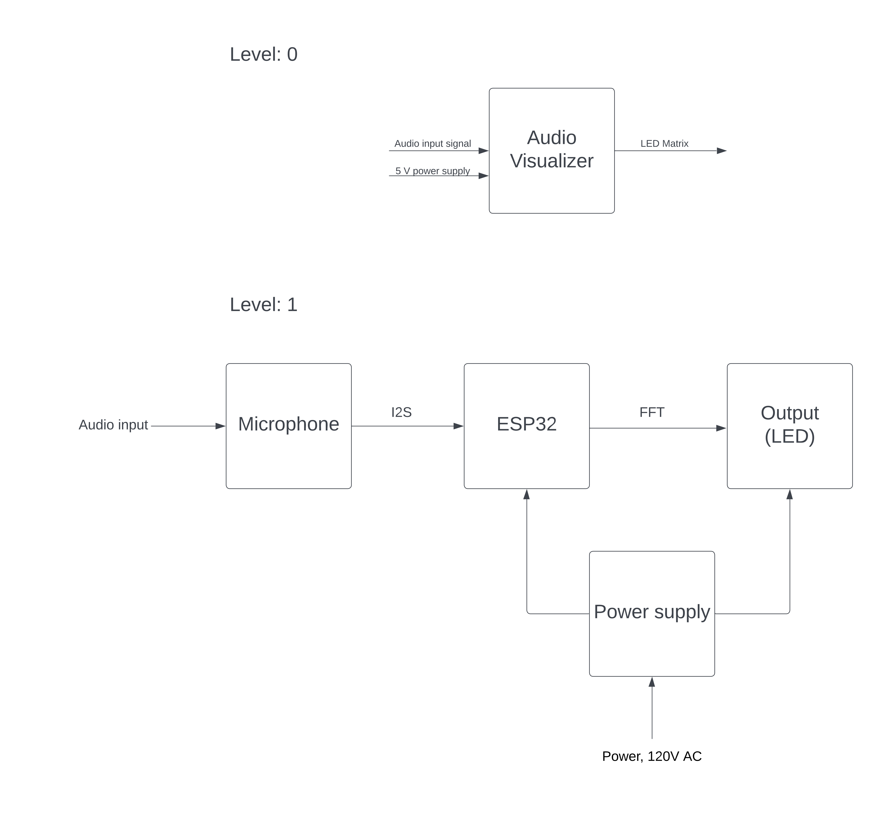

# ECE411 Audio Visualizer - Team 5

A dynamic LED light display that visualizes and reacts to the audio input signal in real-time, by illuminating LED strips in patterns and colors corresponding to the audio’s signal. The audio input will be from an INMP441 microphone.

## Functional Decomposition

## Schematic

