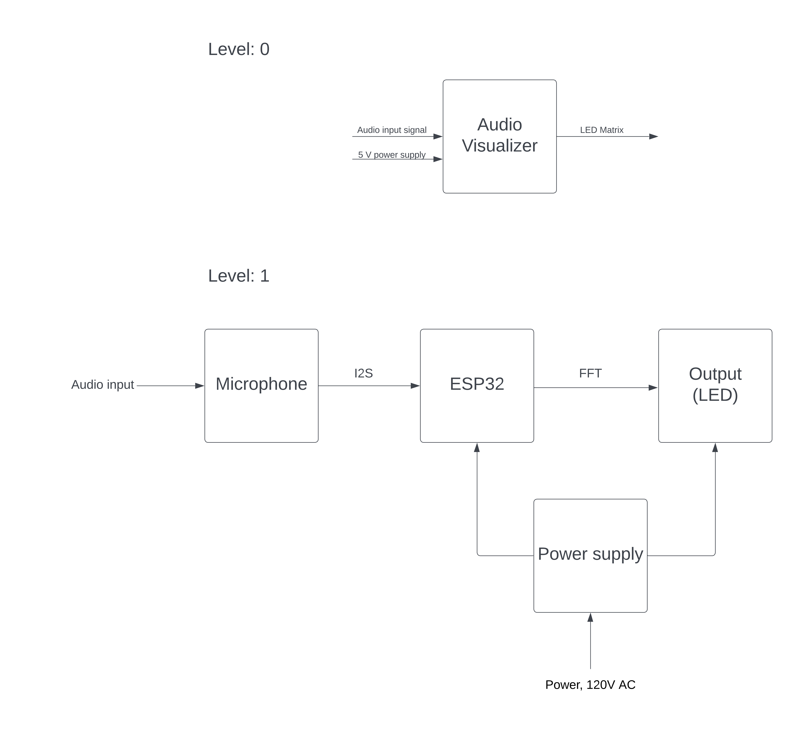
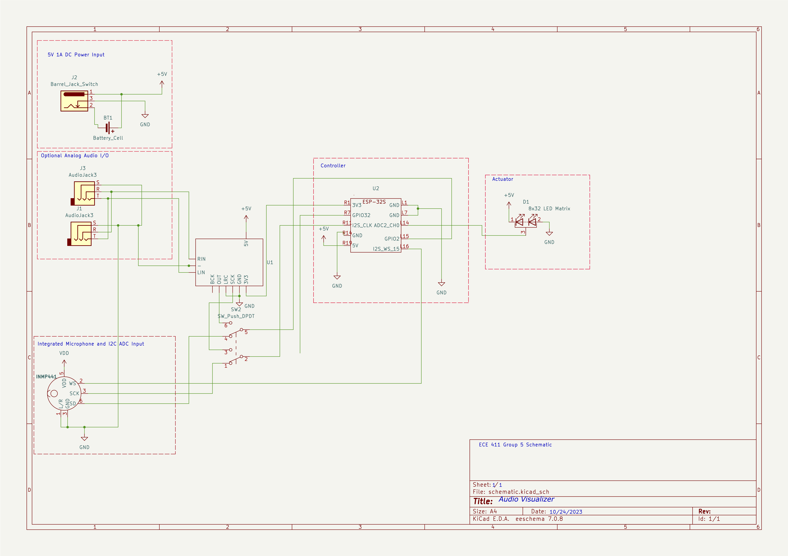
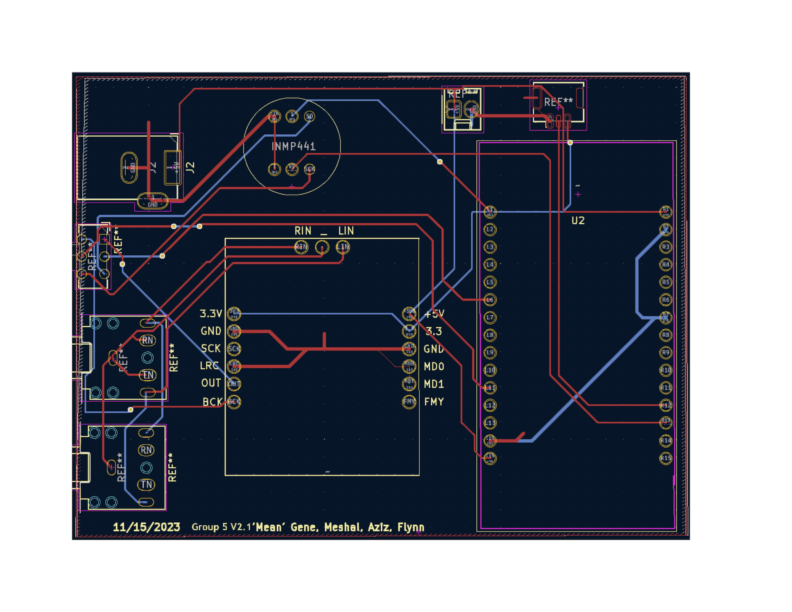
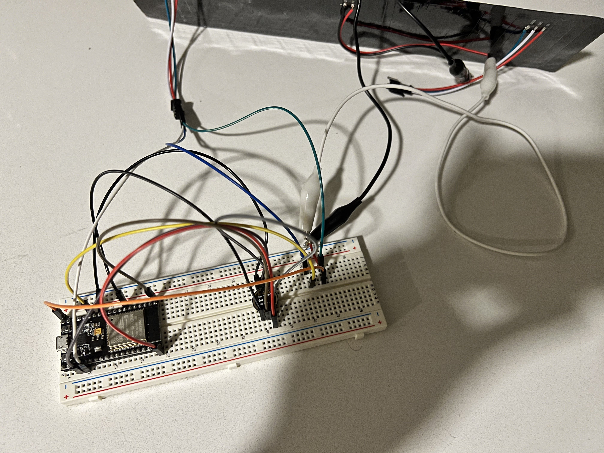

# ECE411 Audio Visualizer

Team 5

Team Members: Abdulaziz Alateeqi, Meshal Almutairi, Gene Hu, Flynn Flynn

## Project Overview
This project is a dynamic audio visualizer that reacts to the audio input signal in real-time, by illuminating an LED panel in patterns and colors corresponding to the audio’s signal. This device will be a must-have gadget for tech enthusiasts to upgrade their listening space. By utilizing digital signal processing and Fast Fourier Transforms, audio signals are displayed visually as beautiful LED arrays. Just plug the device into a standard DC USB block and turn on the power switch and the device is ready to operate.

## System Architecture

## CAD Design

## Software Design

### Audio
- The audio is sampled using I2S.

### FFT
- The FFT is implemented using the ArduinoFFT library.
- The FFT is used to convert the audio signal from the time domain to the frequency domain.
- The FFT is used to determine the amplitude of each frequency.

### LED Matrix
- The LED matrix is controlled using the FastLED and LEDMatrix libraries.
- The LED matrix is used to display the amplitude of each frequency as a bar graph.

## Prototype

  
Click to expand prototype

  

## Design Specification

### Power Requirements
The project will require dedicated 5V 3A power that will need a dedicated AC wall adapter.
- A 2.1mm barrel jack will be mounted directly to the board.
- A standard USB to 2.1mm cable will attach to a Samsung USB block.
- The 5V will attach to the board via a trace (larger duty).

### Sensors
- The first input will be switchable between a 3.5mm TRS line level input.
  - This will run directly to Ain and Din on the ESP32.
  - The input TRS 3.5mm jack will be wired directly to a second TRS that routes audio to an external powered speaker.
- INMP441 microphone module.
- Inputs will be switchable with only one operating at a time.

### Actuators
- The output of the device will be an 8x32 LED matrix.
- The display will be a two-dimensional spectrogram.
  - The X-axis is the different frequencies.
  - The Y-axis is amplitude in volts.
- This will be done by individually addressing each light using each frequency as a logic parameter and the voltage reading to determine how many lights from that column illuminate.
- This will be on a purchased breakout board with power, ground, and address/clk line being connected to PCB via a 4-pin ribbon cable.

### Processing
- All processing will be done on an ESP32 microcontroller.
- Arduino IDE will be used as the programming environment.
- The controller will take in digital audio signals and process them into the frequency domain as a Fourier Transform.
- Different frequencies will be made into control loops for the program output.
- ESP32 will be mounted to the PCB via headers and sockets so the microcontroller can be removed for programming.

## Requirements

### Performance
- Must continuously visualize the input sound until switched off.
- Must be displaying accurate information (i.e., high LED bar if the frequency is overwhelming).
- Must be able to use a microphone to process the audio of surroundings.
- Should be able to take in sound through an audio jack.
  - Should have a speaker.

### User Experience
- Must be portable.
- Must be wall-powered through the adapter.
- Should be simple to use (plug and go).
- May use batteries.
  - May be rechargeable.

### Safety
- Must not overheat or be at risk of burning out LEDs.
- May be able to withstand being dropped lightly (No shattering?).

### Miscellaneous
- Should be able to switch the audio rails for input/output instead of having two separate lines.
